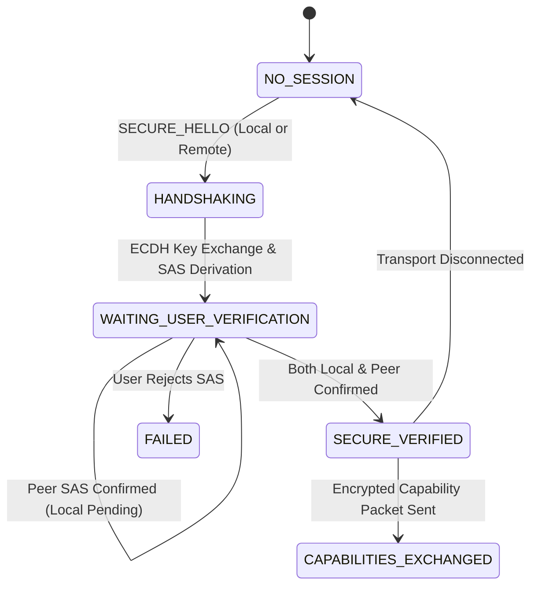

# iTantra Transport Validation Matrix

This matrix documents the verification status across all transport layers (Bluetooth RFCOMM, Local Wi-Fi TCP), secure handshake protocols, capability negotiation, and acknowledgment systems in iTantra.

> **Truthful Evidence Hierarchy**:
> - **Source Test**: Verified via unit tests, interface contracts, state machines, and mocking frameworks in JVM / Android SDK.
> - **Loopback Test**: Verified via in-memory or loopback network/socket execution on host development environment.
> - **Physical Test**: Verified via physical Android arm64-v8a devices attached via ADB.
> - **Architecture Notice**: Bluetooth RFCOMM is a direct 1-to-1 point-to-point stream transport. It is **NOT** a mesh protocol and is never labeled as mesh in technical documentation.

---

## 1. Transport Feature Verification

| Feature / Operation | Source Test | Loopback Test | Physical Test | Evidence Level | Notes |
| :--- | :--- | :--- | :--- | :--- | :--- |
| **Bluetooth connect** | `PASS` (`BluetoothPeerTransport`) | `PASS_SOURCE` | `NOT_TESTED` | SOURCE_READY | RFCOMM client socket with UUID `20f01a35-26a1-432a-bc95-021b36d0130a`. |
| **Bluetooth send** | `PASS` (`BluetoothPeerTransport`) | `PASS_SOURCE` | `NOT_TESTED` | SOURCE_READY | 4-byte length prefix framing followed by complete ciphertext payload. |
| **Bluetooth receive** | `PASS` (`BluetoothPeerTransport`) | `PASS_SOURCE` | `NOT_TESTED` | SOURCE_READY | Asynchronous coroutine read loop reading exact framed byte buffers. |
| **Bluetooth reconnect** | `PASS` (`BluetoothPeerTransport`) | `PASS_SOURCE` | `NOT_TESTED` | SOURCE_READY | Active socket teardown and clean re-establishment of RFCOMM stream. |
| **Wi-Fi server** | `PASS` (`WifiPeerTransport`) | `PASS` | `NOT_TESTED` | LOOPBACK_TESTED | Local TCP `ServerSocket(8888)` with `reuseAddress = true`. |
| **Wi-Fi client** | `PASS` (`WifiPeerTransport`) | `PASS` | `NOT_TESTED` | LOOPBACK_TESTED | TCP client socket connecting to explicit LAN IP/port with 5s timeout. |
| **Wi-Fi send** | `PASS` (`WifiPeerTransport`) | `PASS` | `NOT_TESTED` | LOOPBACK_TESTED | Framed length-prefix transmission over local Wi-Fi TCP connection. |
| **Wi-Fi receive** | `PASS` (`WifiPeerTransport`) | `PASS` | `NOT_TESTED` | LOOPBACK_TESTED | Flow-based `SharedFlow<ByteArray>` byte stream reception. |
| **Wi-Fi reconnect** | `PASS` (`WifiPeerTransport`) | `PASS` | `NOT_TESTED` | LOOPBACK_TESTED | Graceful socket closure and re-binding on connection loss. |
| **ACK (Delivery confirmation)** | `PASS` (`TransportCoordinatorTest`) | `PASS` | `NOT_TESTED` | LOOPBACK_TESTED | `PacketType.ACK` with matching `messageId` transitions message to `DELIVERED`. |
| **HUMAN_ACK (User confirmation)** | `PASS` (`PeerProtocolAndLatencyTest`) | `PASS` | `NOT_TESTED` | LOOPBACK_TESTED | `PacketType.HUMAN_ACK` transitions message to `ACKNOWLEDGED`. Distinct from delivery ACK. |
| **Replay rejection** | `PASS` (`SecureSessionManagerTest`) | `PASS` | `NOT_TESTED` | LOOPBACK_TESTED | Monotonic 64-bit counter tracking; stale/replayed packets rejected with `SecurityException`. |
| **SAS both-confirm** | `PASS` (`PeerProtocolAndLatencyTest`) | `PASS` | `NOT_TESTED` | LOOPBACK_TESTED | State transitions to `SECURE_VERIFIED` ONLY when `localSasConfirmed && peerSasConfirmed`. |
| **Capability exchange** | `PASS` (`PeerProtocolAndLatencyTest`) | `PASS` | `NOT_TESTED` | LOOPBACK_TESTED | Transmitted as encrypted application traffic strictly AFTER `SECURE_VERIFIED`. |

---

## 2. Security & Handshake State Machine Summary

